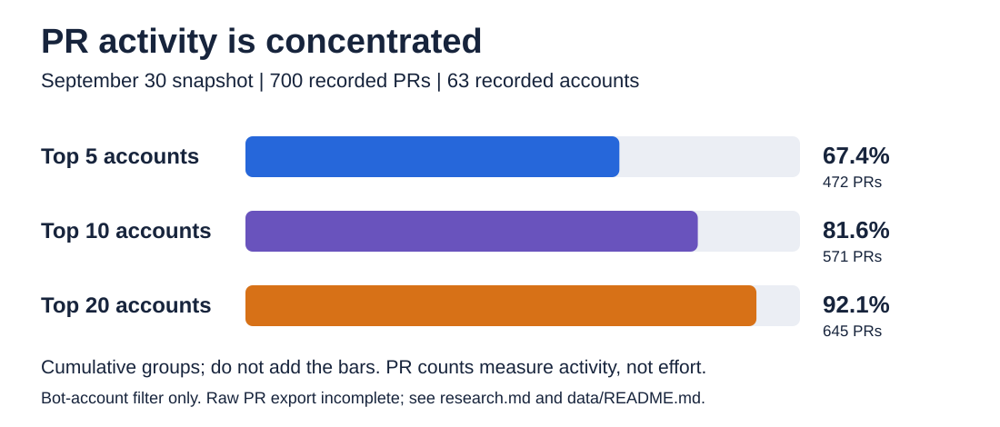
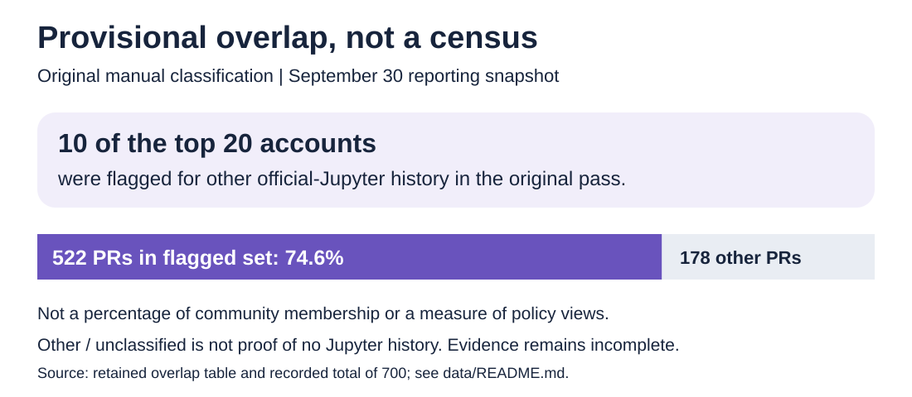

# Week 1 Research: Jupyter AI and AI in Jupyter

**Reporting snapshot: September 30, 2026. Evidence/wording review: October 1, 2026.**

This is an evidence record for [The Eye](the-eye.md), not a second article. The snapshot separates software adding AI capabilities from decisions about AI-assisted development. Sources can change; dates below describe what the evidence supports. No fresh contributor census was conducted in this pass.

## Software record

| Finding | Evidence | Limit |
| --- | --- | --- |
| Jupyter AI prioritized integration of external agents over maintaining its own central agent | [February 24 release plan, #1531](https://github.com/jupyterlab/jupyter-ai/issues/1531) | A planning/decision record; not a benchmark of every agent |
| Version 3.2 made RTC optional while retaining notebook operations | [September 3 release notes](https://jupyter-ai.readthedocs.io/en/stable/releases/v3.2.0.html) | A release claim, not an independent installation test |
| The implementation spans separately versioned components | [Submodule map](https://github.com/jupyterlab/jupyter-ai/blob/main/.gitmodules), [Jupyter Server MCP](https://github.com/jupyter-ai-contrib/jupyter-server-mcp), [JupyterLite AI](https://github.com/jupyterlite/ai) | Repository/package boundaries do not establish governance or opinions |

The first two sources were reopened on October 1 and support the statements above. The component links retain the original snapshot's context; this pass does not claim an exhaustive package inventory. The editorial inference is modular integration, not that all projects will converge on one architecture.

## Contributor snapshot

### Scope and provenance

The original aggregation sampled PRs opened in 2026 in `jupyterlab/jupyter-ai`, `jupyterlite/ai`, and `jupyter-ai-contrib`. Its filter removed accounts reported as bots or with bot-style logins. Use **PRs opened by accounts not identified as bots**, not "human-authored PRs."

For official-Jupyter overlap, the original pass used [public software-subproject guidance](https://jupyter.org/governance/software-subprojects/) and public contribution/governance evidence rather than a private GitHub Enterprise roster. No administrative roster was read. The check intended to find history elsewhere in official Jupyter, not count presence in `jupyterlab/jupyter-ai` itself as proof of that history.

The original aggregation reported 700 PRs and 63 account logins. The retained account-level export contains only 60 rows totaling 697. It is not the raw PR export. See [the data guide](data/README.md) for the original query forms, bot rule, incomplete time-bound record and missing identities.

### Arithmetic verified from retained tables

| Measure | Count | Share of recorded total of 700 |
| --- | ---: | ---: |
| Top 5 accounts, cumulative | 472 | 67.4% |
| Top 10 accounts, cumulative | 571 | 81.6% |
| Top 20 accounts, cumulative | 645 | 92.1% |
| Original manually flagged overlap set | 522 | 74.6% |

The flagged set contains 10 of the top 20 rows: `dlqqq`, `brichet`, `jtpio`, `3coins`, `andrii-i`, `Zsailer`, `erkin98`, `ellisonbg`, `krassowski`, and `MUFFANUJ`.

Those are inherited classifications. The original notes cite general release credits/governance pages but do not retain a direct evidence URL for every row. Do not call all 10 newly verified. A concrete example that readers can inspect is [JupyterLab PR #18322](https://github.com/jupyterlab/jupyterlab/pull/18322), authored by `jtpio`, who also appears in the saved AI account table.

### Interpretation, not measurement

The records are consistent with contributor connections across official and adjacent repositories. They do not establish two distinct populations, the share of all Jupyter contributors involved in AI, or which unclassified accounts are newcomers. PR count measures submitted activity, not labor, influence or merged impact. No review/commenter network was measured, and no policy opinions were collected. Contribution history cannot be used as a proxy for someone's AI stance.

The 74.6% is a **provisional arithmetic result from the original classification**, not a census, confidence interval or fully verified lower bound. A new, retained collection and per-account evidence audit belong to a separately dated follow-up.

## Policy and practice record

| Scope | Evidence kind and period | Supported statement | Source |
| --- | --- | --- | --- |
| Project-wide | April 28 discussion, still a discussion in the reviewed record | Seeks recommendations for subprojects, not one mandatory policy | [Governance #337](https://github.com/jupyter/governance/issues/337) |
| Project-wide | January-started source collection | Collects policies and debates; does not enact one | [Governance #326](https://github.com/jupyter/governance/issues/326) |
| JupyterHub | Adopted contribution policy in the September snapshot | Responsibility, disclosure, quality/copyright review, human communication and no autonomous agent-written-and-submitted PRs; no supporting agent files | [Policy text](https://compass.hub.jupyter.org/contribute/llm/) and [adoption discussion #880](https://github.com/jupyterhub/team-compass/pull/880) |
| JupyterHub | May discussion and individual comments | Internal disagreement about tooling, copyright and framing | [Team Compass #905](https://github.com/jupyterhub/team-compass/issues/905) |
| JupyterLab | Merged January agent guidance and February PR-template change | Accommodates AI-assisted development; asks for disclosure, human review and execution | [#18322](https://github.com/jupyterlab/jupyterlab/pull/18322), [#18413](https://github.com/jupyterlab/jupyterlab/pull/18413) |
| Frontends | February 2026 review experiment | Meeting notes favored opt-in during evaluation | [Meeting notes](https://github.com/jupyterlab/frontends-team-compass/issues/301#issuecomment-3999212671) |

The project-wide discussion and JupyterHub's published policy were reopened October 1. Other rows preserve the dated evidence read during the original research; this pass is not an exhaustive search for later amendments. The February review record does **not** establish the setting in September. The [policy CSV](data/ai-policy-snapshot-2026-09-30.csv) records that distinction.

### Individual perspectives

[Jupyter Book perspective](https://github.com/jupyter/governance/issues/337#issuecomment-4351410946): concern about ongoing maintenance and social/environmental costs, not only whether a patch works. [JupyterLab perspective](https://github.com/jupyter/governance/issues/337#issuecomment-4358507378): costly low-value submissions alongside useful AI-assisted changes. [GeoJupyter perspective](https://github.com/jupyter/governance/issues/337#issuecomment-4348654091): accessibility and contributor ownership; GeoJupyter is adjacent, not treated here as an official subproject. These are the speakers' accounts from the original record, not a poll or the unanimous view of their communities.

The editorial synthesis is that disclosure and human responsibility recur, while communities differ on acceptable assistance and communication. That is not a new Project Jupyter rule. The comparison graphic gives Hub and Lab equally weighted blue/purple panels rather than stop/go colors.

## Session reference outside The Eye

[Serena Bonaretti's June 15 account](https://blog.jupyter.org/posts/2026/becoming-the-new-jupyterhub-and-jupyter-book-community/) describes a path through using Jupyter, workshops and community participation to a community-manager role. This supports the short human closing in the narrative and notes, not a claim that contribution guarantees a career outcome. The article was retrieved again through the public blog's search result on October 1.

## Retained data and visuals

[Data guide](data/README.md), [summary](data/ai-space-pr-summary-2026.csv), [60 account rows](data/ai-space-pr-authors-top60-2026.csv), [20 overlap classifications](data/top20-official-jupyter-overlap-2026.csv), and [policy evidence table](data/ai-policy-snapshot-2026-09-30.csv).

[Concentration](images/contributor-concentration.svg), [provisional overlap](images/contributor-overlap.svg), [policy comparison](images/policy-map.svg), and [optional two-question explainer](images/two-questions.svg). The Eye uses only the concentration and policy visuals; the others are optional supporting material. The original three contributor CSVs remain byte-identical; the caveats do not imply recovered raw data.
