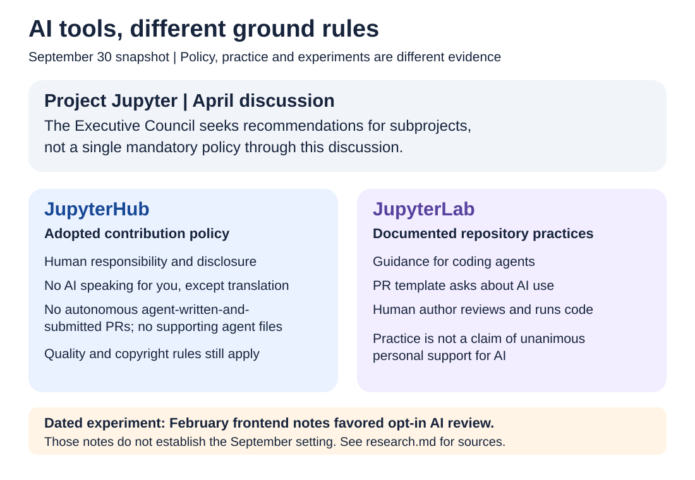

# The Eye - Week 1

## Jupyter builds AI tools. Who sets the rules for using them?

**Reporting snapshot: September 30, 2026**

Two different AI questions are taking shape around Project Jupyter. **Jupyter AI** is software development that brings AI capabilities to notebooks and other Jupyter tools. **AI in Jupyter**, as used in this episode, is the policy question: how should people use AI to develop Jupyter itself?

Building those capabilities does not settle the rules for contributing them. Public development records show new software alongside different approaches to authorship, disclosure and review.

## The software: more connections, not one chatbot

In its [February release plan](https://github.com/jupyterlab/jupyter-ai/issues/1531), Jupyter AI shifted its priority from building its own agent, Jupyternaut, toward integrating existing agents. The maintainers described the cost of keeping a reliable agent up to date as a reason for that choice.

The Agent Client Protocol connects agents to the Jupyter interface. Related [MCP tooling](https://github.com/jupyter-ai-contrib/jupyter-server-mcp) exposes Jupyter capabilities to agents. These are interfaces between pieces, not new foundation models.

September's [Jupyter AI 3.2 release](https://jupyter-ai.readthedocs.io/en/stable/releases/v3.2.0.html) made real-time collaboration optional while retaining notebook editing and execution. [JupyterLite AI](https://github.com/jupyterlite/ai) offers another user experience. The software picture is increasingly modular rather than centered on one assistant.

## The people: overlap across repository boundaries

An exploratory sample covered `jupyterlab/jupyter-ai`, `jupyterlite/ai`, and the adjacent `jupyter-ai-contrib` organization. The original aggregation recorded **700 PRs from 63 accounts not identified as bots**. That does not establish whether a person or AI wrote the submitted content.

The five most active accounts opened 472 of those PRs: **67.4% of the recorded total**. This measures submitted activity, not effort, influence, or acceptance of the changes.

The original manual check marked 10 of the top 20 accounts as having other official-Jupyter contribution or governance history. Their 522 PRs represent **74.6% of the recorded total**, a provisional overlap calculation, not a population estimate. For example, `jtpio` appears in the saved AI activity and proposed [JupyterLab's coding-agent guidance](https://github.com/jupyterlab/jupyterlab/pull/18322).

The limits matter: only 60 account rows, covering 697 PRs, were retained; a complete PR-level export and direct evidence for every classification were not. Unclassified accounts cannot be called newcomers. The findings suggest connections between the groups, not that they are identical. [Methods, data and limitations](research.md#contributor-snapshot).

## The rules: different approaches within Jupyter

The Executive Council's [April community discussion](https://github.com/jupyter/governance/issues/337) seeks recommendations for subprojects, explicitly not a single mandatory Jupyter-wide policy. That is the scope of this discussion, not proof that every policy question has been resolved.

**JupyterHub has an adopted policy.** Its [LLM contribution rules](https://compass.hub.jupyter.org/contribute/llm/) require disclosure and a human who understands and takes responsibility for the submission. They allow rejection of low-quality or copyright-questionable work, prohibit AI speaking for contributors except for translation, and prohibit autonomous agent-written-and-submitted PRs. The policy also declines supporting agent-instruction files. This is not a ban on every use of AI.

**JupyterLab has concrete repository practices.** It added [coding-agent guidance](https://github.com/jupyterlab/jupyterlab/pull/18322) and [PR disclosure questions](https://github.com/jupyterlab/jupyterlab/pull/18413) about AI use, tools, human review and running the code. Those practices accommodate assistance while leaving responsibility with the contributor.

Frontend meeting notes also record an **opt-in Copilot-review experiment in February**. That dated experiment should not be presented as a verified September setting. [The meeting record](https://github.com/jupyterlab/frontends-team-compass/issues/301#issuecomment-3999212671) is evidence of what was discussed then.

## Disagreement is not a split into two camps

Individual comments explain why simple labels fail. In the project-wide discussion, [a Jupyter Book contributor](https://github.com/jupyter/governance/issues/337#issuecomment-4351410946) describes concerns about maintainer capacity even when code works. [A JupyterLab maintainer](https://github.com/jupyter/governance/issues/337#issuecomment-4358507378) reports costly, low-value submissions while recognizing good AI-assisted work. [A GeoJupyter contributor](https://github.com/jupyter/governance/issues/337#issuecomment-4348654091) emphasizes accessibility and genuine human participation. GeoJupyter is an adjacent community, not treated here as an official subproject.

These are personal accounts, not votes or unanimous subproject positions. Nor does the contribution dataset reveal anyone's opinion about AI. The recurring question is who understands the work, communicates about it and maintains it after submission.

The next useful development may be a policy revision, a changed review practice, or no agreement at all. Software capability and permission to contribute are separate decisions. Jupyter's public records let readers follow both without pretending the story is finished.

---

[Research and source status](research.md) | [Data guide](data/README.md) | [Provisional overlap chart](images/contributor-overlap.svg)

*An independent feature for this discussion series, not an official Project Jupyter policy statement. Evidence and wording reviewed October 1; the reporting snapshot remains September 30.*
