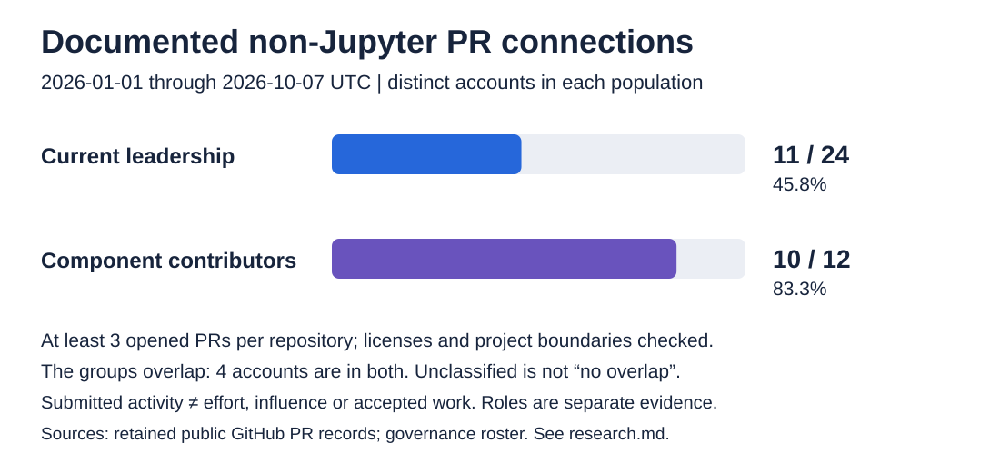
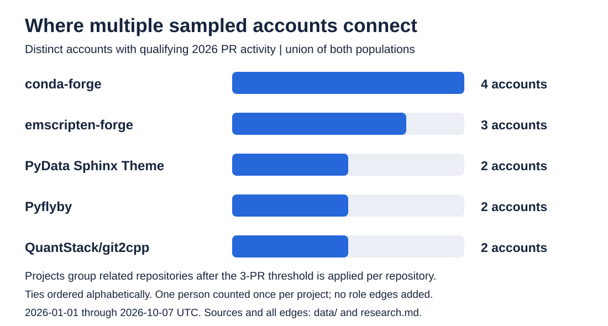

# The Eye - Week 2

## The people between the projects

**Reporting window: January 1–October 7, 2026 UTC | Source snapshot checked October 8 UTC / October 7 Pacific**

Jupyter's governance leaders and active software contributors also work in other open-source projects. In this analysis, **11 of 24 current governance leaders (45.8%)** and **10 of 12 key contributors in the Week 2 component sample (83.3%)** opened at least three pull requests in a qualifying non-Jupyter repository during the reporting window. The recorded connections include package distribution, documentation, numerical software and alternative notebook tools. [Data and calculations](research.md#results).

Brian Granger provides a separate governance example. The Jupyter co-founder appears on [PyTorch's Governing Board](https://pytorch.org/governing-board/); Jupyter's [directory](https://jupyter.org/governance/people/) records his former Executive Council and Foundation service. That is a documented historical Jupyter/current PyTorch connection. He is outside both populations counted here.

### Who is counted

**Leadership** means the deduplicated union of Jupyter's [Foundation Governing Board](https://jupyter.org/governance/jupyter-foundation/) and [Software Steering Council representatives](https://jupyter.org/governance/software-subprojects/): 24 people in the checked public rosters.

**Key contributors** means the five accounts opening the most PRs in each of [JupyterLab](https://github.com/jupyterlab/jupyterlab), [Jupyter Server](https://github.com/jupyter-server/jupyter_server) and [ipykernel](https://github.com/ipython/ipykernel), including ties, after excluding identified bot and machine accounts. Their 1,050 PR records leave 801 retained submissions from 195 accounts. The selection produces 12 distinct accounts, responsible for 446 of those submissions.

Four selected contributors also belong to the leadership population, so the combined set contains **32 distinct accounts**. This view is limited to people serving in these defined governance roles and accounts making attributable contributions through the sampled software repositories. It does not represent the whole Jupyter community or every form of leadership and participation.

### Repeated contributions outside Jupyter

A qualifying recent connection requires **at least three PRs opened by the sampled account in one external repository**. Attributable means that the PR's recorded opening account matches the account being measured. This is a count of submitted work, including packaging and documentation; it does not establish who wrote every change or whether it was accepted.

The higher contributor rate describes a group selected for recent PR activity, whereas the leadership group is selected by governance appointment. The populations overlap and have different selection rules; these percentages do not rank their effort or influence.

Official Jupyter subprojects and adjacent extensions, kernels and deployments are classified separately. The figures above count independent non-Jupyter open-source software. Fork-local submissions and unresolved licenses are excluded. [Classification evidence](data/project-registry.json).

### Which projects share contributors

Five project groups have qualifying PRs from more than one sampled account. [The project table](data/external-project-summary.csv) identifies each connection:

| Project | Qualifying accounts |
| --- | --- |
| conda-forge | Ian Thomas, Johan Mabille, Martin Renou, Min Ragan-Kelley |
| emscripten-forge | Ian Thomas, Johan Mabille, Martin Renou |
| PyData Sphinx Theme | Carreau, Yann-P |
| Pyflyby | Carreau, krassowski |
| QuantStack/git2cpp | Ian Thomas, Johan Mabille |

Names are used where explicitly documented; other entries remain account logins.

The [retained PR records](data/recent-edges.csv) make these links concrete. In emscripten-forge recipes, Ian Thomas opened **55 PRs** and Johan Mabille **23**. In git2cpp, their counts were **37 and six**, respectively. conda-forge connections count packaging work, rather than contributions to each packaged project's upstream source.

Across the combined population, **94 non-Jupyter project groups** meet the threshold. Eighty-nine have one qualifying account; five have multiple accounts. The overlap therefore consists of a few shared destinations and many individual external connections.

### Documented roles add a different kind of overlap

Min Ragan-Kelley and Sylvain Corlay appear in [conda-forge's core-team roster](https://github.com/conda-forge/governance/blob/main/teams/core.csv). Ragan-Kelley is also a [PyZMQ package maintainer](https://pypi.org/project/pyzmq/), and Chris Holdgraf appears among [PyData Sphinx Theme's package maintainers](https://pypi.org/project/pydata-sphinx-theme/).

These are explicit role listings. Separately, Ragan-Kelley opened **ten PyZMQ PRs**, all merged by the cutoff. Jupyter SSC representative Martha Cryan opened **seven marimo PRs** and **four Plotly.js PRs**; seven and three, respectively, were merged. Those records establish submissions and acceptance, not governance appointments. [Direct PR and role evidence](research.md#results).

The limited role check documents three Jupyter leaders with external roles. Including those listings raises the leadership match count from 11 to **12 of 24**, because Corlay does not meet the recent-PR threshold. It is not an exhaustive external-role census.

The evidence establishes cross-project participation within this bounded population: repeated contributions by most sampled component contributors, external work by nearly half the governance roster, and explicit maintainer overlap. Reviews, direct commits, support and organizing remain outside the measure. Missing evidence stays unknown.
